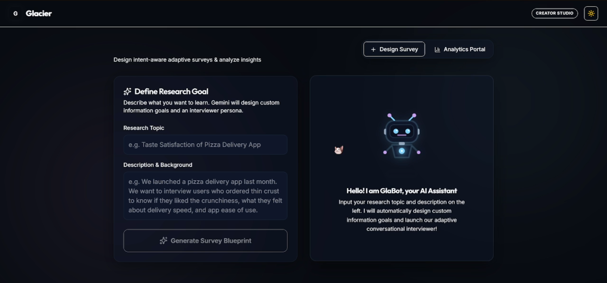
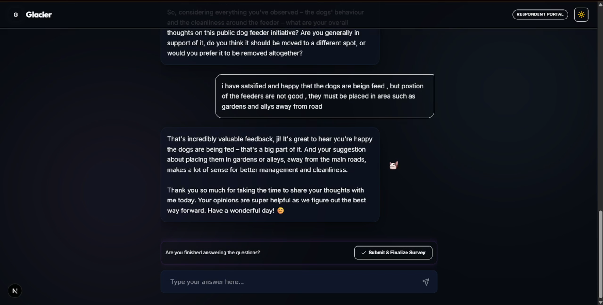
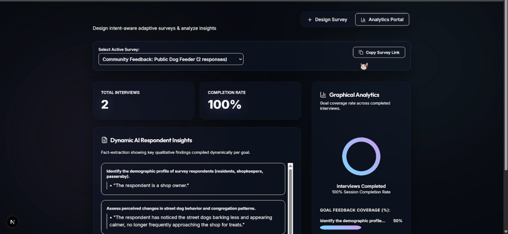

# Glacier

**Adaptive Conversational Survey AI**

Glacier is an AI-powered conversational survey platform that replaces traditional static web forms with adaptive AI interviews. Instead of asking every respondent the same fixed questions, Glacier conducts dynamic conversations, adapts follow-up questions based on responses, supports natural language (including Hinglish), and automatically transforms conversations into actionable insights through visual analytics.

---

## Why I Built It

While validating a startup idea, I realized that traditional survey tools like Google Forms collect answers but rarely capture conversations. Static questionnaires often miss context, cannot adapt to a respondent's answers, and require hours of manual qualitative analysis.

Glacier was built to make surveys feel like natural interviews while automatically extracting meaningful insights from every conversation.

---

## Demo

🎥 

---

## Screenshots

### Dashboard



### AI Conversation



### Analytics Dashboard



---

## Features

- 🤖 AI-powered conversational surveys
- 💬 Adaptive follow-up questioning
- 🎭 Persona-based AI interviewers
- 🌐 Hinglish and natural language support
- 📊 Automated qualitative insight extraction
- 📈 Visual dashboard and analytics
- 📋 Coverage charts based on research goals
- 📝 Survey creation interface
- ⚡ Streaming AI conversations

---

## Tech Stack

### Frontend
- Next.js 15
- React
- Tailwind CSS
- Framer Motion

### AI
- Gemini 2.5 Flash Lite
- Vercel AI SDK

### Backend
- Next.js API Routes

### Database
- Local JSON-based mock database (`db.json`)

### UI
- Lucide React Icons

---

## Installation

Clone the repository:

```bash
git clone https://github.com/YOUR_USERNAME/glacier.git
```

Navigate to the project:

```bash
cd glacier
```

Install dependencies:

```bash
npm install
```

Start the development server:

```bash
npm run dev
```

Open **http://localhost:3000** in your browser.

---

## Future Improvements

- 🔐 User authentication
- ☁️ Cloud database integration
- 🌍 Multi-language support
- 🎙️ Voice-based AI interviews
- 👥 Team collaboration
- 📄 Exportable reports (PDF/CSV)
- 📱 Mobile-responsive enhancements

---

## License

This project is licensed under the MIT License.

---

## About

Glacier was built as part of validating a startup idea in the arts ecosystem. The goal was to rethink how qualitative surveys are conducted by replacing static forms with intelligent AI-driven conversations that generate richer insights with significantly less manual effort.